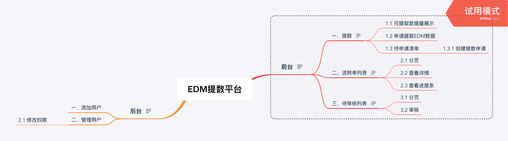

---------------------

Author: Li Fei

Date: 2019-06-14

--------

# 一、EDM项目功能图

# 二、核心功能

## 1.1 提数申请流转逻辑

1）用户通过页面选择提数条件，点击"加入申请清单"，保存到"提数待申请清单"，成为提数申请清单的一个子项目（目标用户）；

2）用户从导航栏进入"提数待申请清单"，通过勾选子项目，点击"创建申请"，进入申请页面；

3）在申请页面，用户需要填写申请信息，信息填写完毕，点击"提交申请"，该申请进入审批流程；

审批状态：

​     0 待申请组初审；

​     1 申请组初审不通过；

​     2 申请组组长审核通过，能力组待审核；

​     3 能力组待审核不通过；

​     4 能力组审核通过，客服组待审核；

​     5 客服组审核不通过；

​     6 客服组审核通过，待数据组处理；

​     7 数据组处理完成;

4）用户从导航栏进入"提数申请列表"，在申请列表中，列出该用户的申请列表；

​     4.1 在"申请列表"中，用户点击"查看详情"，将可以看到审批进度条

5）审批流程：

​    5.1 申请组组长页面

​          审核通过、审核不通过

​          审核通过，提交给能力组；审核不通过，审批流程结束

​    5.2  能力组页面

​         审核通过、审核不通过

​         审核通过，提交给客服组；审核不通过，审批流程结束

   5.3  客服组页面

​        审核通过、审核不通过

​        审核通过，提交给数据组，并将目申请项添加到消息队列，审批流程结束；审核不通过，审批流程结束；

6）数据组处理

​       方案一： 定时判断消息队列是否有数据，进行处理；

​       方案二：由运营人员点击"提数"，进行提数操作； 

7） 提完数据，生成数据编码，用户能够查看；

​        

## 1.2 权限管理

在前端和后端同时控制，如果用户没有权限，用户将不能看到相应的操作按钮，并且不能进行响应的请求。

1）运营者权限

- 展示“提数”选项，能够进行如下操作；
  - “可提取数据量”查询；
  - “申请提取EDM数据”；
  - “待申请清单”；
- 展示“流转单列表”选项，能够查询流转单列表；

2）申请组权限

- 待审核列表
- 流转单列表
- 数据编码列表

3） 能力组权限

- 待审核列表
- 流转单列表
- 数据编码列表

4） 客服组权限

- 待审核列表
- 流转单列表
- 数据编码列表

5） 数据组权限

所有权限

